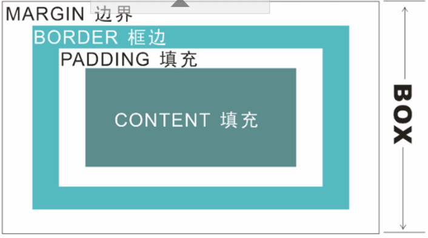

### 第五章：CSS盒子模式
      图解盒子模式
盒子        |  详情
:-----------------:|:-----------------:|
 | 

#### 5.1 盒子相关属性

##### 5.1.1 内边距和外边距
    在Web页面中的“盒子”的结构：厚度、边距（边缘与其它物体的距离）、填充（填充厚度）。
    引申到CSS中，就是border、margin和padding。当然，不能少了内容。
    也就是说整个盒子在页面中占的位置大小应该是内容的大小加上填充的厚度再加上边框的厚度再加上它的边距。
    i. 外边距
        外边距属性，也称为边界属性，根据上、下、左、右四个方向，可细分为
        上边距（margin-top）、下边距（margin-bottom）、左边距（margin-left）、右边距（margin-right）。
        一般情况下，可以使用margin属性一次性设置四个边距，也可以分别对不同的边距设置不同的属性，
        设置时必须按顺时针方向依次代表上，右，下，左四个方向的属性值。如果省略则按上下，左右同值处理。
    ii. 边框属性（border）
        边框有三个属性：颜色（border-color）、粗细（border-width）、样式（border-style）。
    iii. 内边距（padding）
        内边距属性，也称为填充属性，设置的是内容与边框的距离。同外边距属性一样，
        内边距属性也包括上、下、左、右四个方向的属性值，其使用方法请参照外边距属性代码。

##### 5.1.2 块级元素和行内元素
    i. 简介
        标准文档流：CSS所规定的块级元素和行内元素的默认排列方式。
            块级元素（block）默认占一行，一行内添加一个块级元素后一般无法添加其他的元素。
                例如div、p、h1~h6、ul、ol、table都是块级元素。
            行内元素（inline）会在一条直线上排列（默认宽度只与内容有关），
            都是同一行的，水平方向排列。例如a、span、img都是行内元素。
        它们的区别如下：
            块级元素可以包含行内元素和块级元素。行内元素不能包含块级元素，只能包含文本或者其它行内元素。
            行内元素与块级元素属性的不同，主要是盒模型属性上：块级元素宽高，
            行高以及外边距和内边距都是可控的。行内元素设置width无效，
            height无效(可以设置line-height)，margin上下无效，padding上下无效。
    
    ii. 块级元素的用法：
        div元素是块级元素，实际上，div就是一个容器，它把文档分成独立的、不同的部分。
        div还有一个最长用的用途是文档布局。
    iii. 行内元素的用法：
        span标签是行内元素，用来组合文档中的行内元素。通过使用span标签，
        可以更好的管理行内元素。如果不加样式的话，span元素中的文本与其他文本不会有任何区别。
    iv. margin
        A. 行内元素之间的水平margin 
            span.left{
                margin-right:30px;
                background-color:#a9d6ff;
            }
            span.right{
                margin-left:40px;
                background-color:#eeb0b0;
            }
        
        B. 块级元素之间的竖直margin (注：塌陷现象，margin的合并)
            <body>
                
块元素1

                
块元素2

            </body>
        
        C. margin中的负值	
            span.left{
                margin-right:30px;
                background-color:#a9d6ff;
            }
            span.right{
                margin-left:-53px;			/* 设置为负数 */
                background-color:#eeb0b0;
            }
水平设置|垂直设置|margin取负值
:-------------------:|:------------------------:|:------------------------:|
||

#### 5.2 浮动定位
    在CSS中，如何定位是网页整体布局的关键。
    CSS有三种基本的定位机制：普通流、浮动和位置定位。

##### 5.2.1 float属性
    float 属性定义元素在哪个方向浮动。以往这个属性总应用于图像，
    使文本围绕在图像周围，不过在 CSS 中，任何元素都可以浮动。
    浮动元素会生成一个块级框，而不论它本身是何种元素。
取值|含义
:-----:|:-----:|
left   | 元素向左浮动
right  | 元素向右浮动
none   | 默认,元素不浮动,并会显示在其文本出现的位置
inherit| 从共父类继承浮动属性

##### 5.2.2 clear属性
    如果希望清除浮动对元素的影响，可以使用clear属性。
    clear属性有5个可能值，left，right，both，none和inherit。
    clear:left将清除左浮动的影响，同样clear:right是清除右浮动的影响。

#### 5.3 位置定位
    比起浮动定位，位置定位更加准确、具体、易控制。

##### 5.3.1 position属性 
    position属性:position属性可以使元素显示在网页中任意指定的位置上。
    在CSS布局中，position很重要，很多容器的定位是用position来完成。
        position属性有四个可选值，它们分别是：static、absolute、fixed、relative。
取值        |     描述
:----------:|:---------:|
absolute    |	绝对定位，相当于static定位以外的第一个父元素进行定位,元素位置 通过left、right、top、bottom属性进性规定
fixed       |	固定定位，相对浏览器窗口进行定位，元素位置 通过left、right、top、bottom属性进性规定
relative    |	相对定位，相对于其正常位置进行定位，并保持其定位前的形状和所占的空间
static      |	默认，元素在页面流中正常出现，并作为页面流的一部分
inherit     |   固定从父元素继承position的属性

    static：
        这是默认的属性值，也就是该盒子按照标准流（包括浮动方式）进行布局。
    Relative：
        称为相对定位，使用相对定位的盒子的位置根据常以标准流的排版方式为基础，
        然后使盒子相对于它在原本的标准位置偏移指定的距离。
        相对定位的盒子仍在标准流中，它后面的盒子仍以标准流方式对待它。
    Absolute：
        绝对定位，盒子的位置以他的包含框为基准进行偏移。绝对定位的框从标准流中脱离。
        这意味着它们对其后的兄弟盒子的定位没有影响，
        其他的盒子就好像这个盒子不存在一样。
    Fixed：
        称为固定定位，它和绝对定位类似，只是以浏览器窗口为基准，进行定位。

#### 5.4 隐藏与显示
##### 5.4.1 visibility 属性
    visibility 属性控制着元素的显示与隐藏。如果一个元素的visibility属性设置为hidden，
    即表现为不可见的形式，但是元素不可见并不等于它不存在，它仍旧会占据页面的部分位置，从而影响页面的布局。
属性        |       描述
:----------:|:----------:|
visible     | 默认值设置元素可见
hidden      | 元素被隐藏，但仍然占有部分页面位置，仍然影响页面的布局。
collapse    | 当在表格元素中使用时，此值可删除一行或一列，但是它不会影响表格的布局。被行或列占据的空间会留给其他内容使用。如果此值被用在其他的元素上，会呈现为 "hidden"。

##### 5.4.1 z-index 属性
    z-index 属性设置元素的堆叠顺序。拥有更高堆叠顺序的元素总是会处于
    堆叠顺序较低的元素的前面
        img
        {
        position:absolute;
        left:0px;
        top:0px;
        z-index:-1;
        }
##### 5.4.1 display 属性
    display 属性规定元素应该生成的框的类型。
    这个属性用于定义建立布局时元素生成的显示框类型。
    对于 HTML 等文档类型，如果使用 display 不谨慎会很危险，
    因为可能违反 HTML 中已经定义的显示层次结构。
    对于 XML，由于 XML 没有内置的这种层次结构，所有 display 是绝对必要的。
        <body>
            
Box-1

            
Box-2

            
Box-3

            Box-4
            Box-5
            Box-6
            
Box-7

            Box-8
        </body>

        <body>
            
Box-1

            
Box-2

            
Box-3

            Box-4
            Box-5
            Box-6
            
Box-7

            Box-8
        </body>
##### 5.4.4 悬浮菜单
