### 第8章 JavaScript对象
    i. 认识js对象
类型    |   涉及内容  
:--------:|:--------:|
内置对象   |将一些常用的功能预先定义成对象
浏览器对象 |浏览器和网页本身的各种元素在js程序中的体现
DOM　对象  |HTML DOM对象定义了用于HTML的一系列标准的对象，以及访问和处理HTML文档的标准的方法
自定义对象 |JS允许用户自定义对象进行使用
#### 8.1 JS内置对象
对象             |        用途      |     对象    |      用途      
:---------------:|:---------------:|:-----------:|:-----------:|
String 字符串对象 | 提供了对字符串进行处理的属性和方法 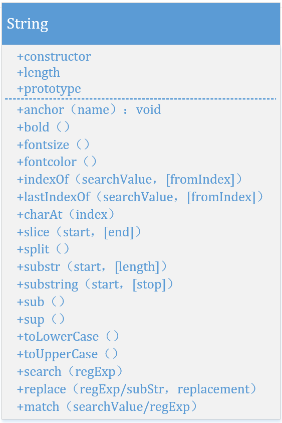   |  Math 数学对象     | 提供了进行所有基本数学计算的功能和常量的属性和方法 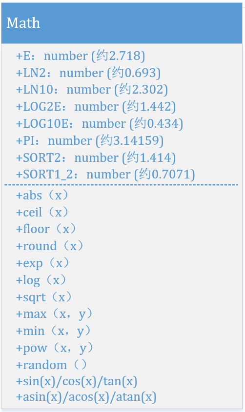
Date 日期对象     | 提供了获取、设置日期和时间的属性和方法 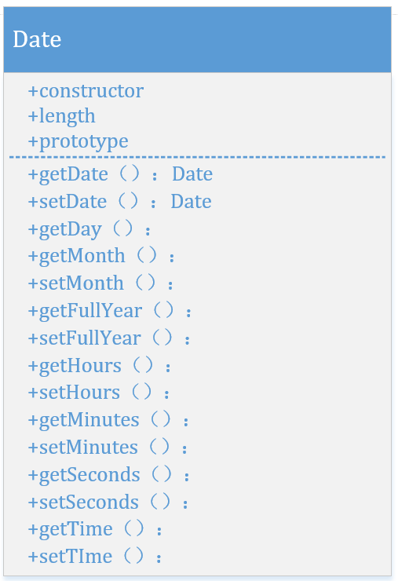 |  Array 数组对象    | 用来创建数组 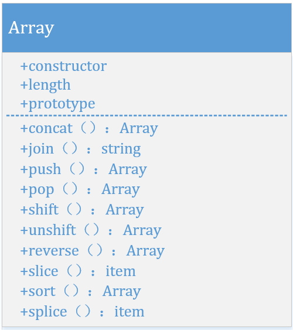
Number 对象      |  是原始数值的包装对象 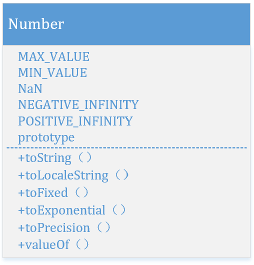        |    Regexp 正则对象    | Js提供了一个RegExp对象来完成有关正则表达式的匹配功能 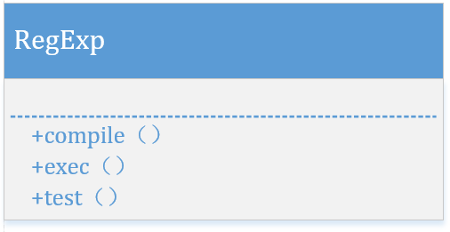

##### 8.1.2 Math对象
    A. Math的创建
    内置的Math对象可以用来处理各种数学运算，提供简单算术运算以外的属性和方法
    Math对象不需要额外创建，Math的属性和方法可以直接调用，其语法格式为：
        Math.属性名
        Math.函数名(参数列表)
    B. Math对象的属性
        Math对象提供了许多特殊的常量，在数学计算中可以直接使用这些常量。
    C. Math对象的方法：Math对象中包括与数学运算相关的一些函数。
        round()返回最接近的整数值。
        random()返回 0 到 1 之间的随机数。
        max()返回两个给定的数中的较大的数。 
        min()返回两个给定的数中的较小的数。 

##### 8.1.3 Date对象
    1. Date对象的创建
        Date对象用来对日期和时间进行操作，它的大多数方法需要利用对象来调用，
        因此必须先声明和创建Date对象。必须使用new运算符创建一个实例。
        语法格式如下：
            var 对象名=new Date()(表示当前的日期和时间)
            var 对象名=new Date(年,月,日)
            var 对象名=new Date(年,月,日,时,分,秒)
            var 对象名=new Date(年,月,日,时:分:秒)
    2. Date对象的属性
        Date对象没有提供可以直接访问的属性，只有获取和设置日期和时间的方法。
    3. Date对象的方法
        Date对象主要提供了以下3类方法：
        1.从系统中获得当前的时间和日期
        2.设置当前的日期和时间
        3.在时间、日期同字符串之间完成转换

        Date对象的主要方法有：
            getYear():返回年份
            getMonth()返回当月于号，0~11,0为1月
            getDate():返回当前日号数
            getDay():返回星期几，0~6，0为星期日
            getHours():返回小时数，0~23
            getMinutes():返回分钟数，0~59
            getSeconds():返回描述，0~59
            getTimes():返回毫秒数，自1970年1月1日零时以来的毫秒数

##### 8.1.4 String对象
        在JavaScript中，一个字符串是一个对象。
        String对象，提供给特定的字符串完成各种处理的属性与方法，如搜索字符串、提取子串等。
        1. String对象的创建
            字符串变量的初始化通常有以下两种方式。
            声明字符串变量时直接为其赋值。例如：
            var str=“Hello World”; 
            使用new关键字创建字符串对象并在构造函数中提供初始化参数。例如：
            var str=new String(“Hello World”);
        2. String对象的属性
            String对象只有一个属性length，表示字符串的长度。
            例如:
            MyStr=“hello JavaScript World”;
            length=MyStr.length;
        3. String对象的方法
            String对象的方法共有19个，主要用于对有关字符串在Web页面中的显示、
            字体大小、字体颜色、字符搜索以及字符的大小写转换
            第一类，关于字符串的运算：
                charAt(index) / charCodeAt(index) (位置)
                indexOf     (子串，起始位置索引)
                lastIndexOf (子串，起始位置索引)
                substring   (起始位置索引，结束位置索引)
                cancat(newString1,...) 连接字符串
                replace(regex,newString)  替换
                slice(startIndex,endIndex) 切片
                toLowerCase()   小写
                toUpperCase()   大写
            第二类、关于字符串在web页面中的显示处理，即用来给字符串的前后加上HTML标签：
                fontcolor(颜色)     |   fixed()  :固定间距
                fontsize(字号)      |   big()    :字体变大
                bold()    :加粗     |   small()  :字体闪烁
                italics() :斜体     |   anchor() :创建书签链接
                blink(秒)  闪烁     |   link(url):创建超链接
                strike()  :删除线   |   
                sub()     :下标     |   sup()   :上标

##### 8.1.5 Number对象
    1.创建 Number 对象
        var myNum=new Number(value);
        var myNum=Number(value);
        参数value是要创建的Number对象的数值，或是要转换成数字的值。
        当 Number() 和运算符 new 一起作为构造函数使用时，它返回一个新创建的Number对象。
            如果不用new运算符，把 Number() 作为一个函数来调用，它将把自己的参数转换成一个原始的数值，
            并且返回这个值（如果转换失败，则返回 NaN）。
    2.Number 对象描述
        a. 在 JavaScript 中，数字是一种基本的数据类型。
            JavaScript 还支持 Number 对象，该对象是原始数值的包装对象。
            在必要时，JavaScript 会自动地在原始数据和对象之间转换。
            在 JavaScript1.1中，可以用构造函数 Number()明确地创建一个Number对象，尽管这样做并没有什么必要。
        b. 构造函数Number()可以不与运算符new一起使用，而直接作为转化函数来使用。
            以这种方式调用Number()时，它会把自己的参数转化成一个数字，然后返回转换后的原始数值（或 NaN）。
        c. 构造函数通常还用作 5个有用的数字常量的占位符，
            这 5 个有用的数字常量分别是可表示的最大数、可表示的最小数、正无穷大、负无穷大和特殊的 NaN 值。
            注意，这些值是构造函数Number()自身的属性，而不是单独的某个Number对象的属性。

##### 8.1.6 Array对象
    在JavaScript中使用new和Array关键字来创建数组对象。创建数组的语法有以下几种：
        1. 创建一个数组
            var 数组对象名= new Array();
        2. 创建一个数组并指定长度
            var 数组对象名= new Array(size);
        3. 创建一个数组并赋初值
            var 数组对象名= new Array(element0, element1, ..., elementN);
        4. 创建一个数组并赋初值
            var 数组对象名=[element0, element1, ..., element];
    sort() 方法用于对数组的元素进行排序。
        
        输出：George,John,Thomas,James,Adrew,Martin
              Adrew,George,James,John,Martin,Thomas
    push() 方法可向数组的末尾添加一个或多个元素，并返回新的长度。
        
        输出：
            George,John,Thomas
            4
            George,John,Thomas,James
    pop() 方法用于删除并返回数组的最后一个元素。
        
        输出：
            George,John,Thomas
            Thomas
            George,John
    join() 方法用于将数组的数据通过分隔符连接起来

#### 8.2 BOM对象
    BOM是browser object model的缩写，简称浏览器对象模型。
        在JavaScript中，浏览器对象用于访问当前页面以及浏览器本身的信息。
        BOM提供了独立于内容而与浏览器窗口进行交互的对象，
        由于BOM主要用于管理窗口与窗口之间的通讯，因此其核心对象是window。
        BOM由一系列相关的对象构成，并且每个对象都提供了很多方法与属性。

BOM模型               |      DOM模型
:--------------------:|:--------------:|
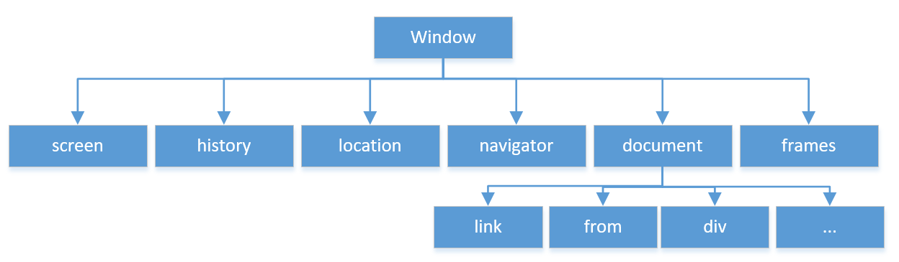|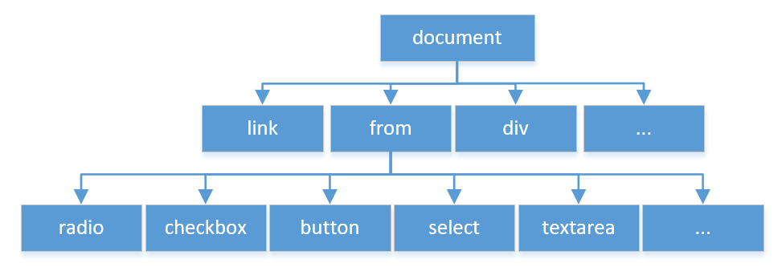

常用的浏览器对象主要有以下几种：
对象                |         描述
:------------------:|:------------------:|
1.窗口对象(window)   |window对象处于对象层次的最顶端，它提供了处理浏览器窗口的方法和属性。
2.位置对象(location) |location对象提供了与当前打开的URL一起工作的方法和属性，它是一个静态的对象。
3.历史对象(history)  |history对象提供了与历史清单有关的信息。
4.文档对象(document) |document对象包含了与文档元素(elements)一起工作的对象， 它将这些元素封装起来供编程人员使用。可以使用document作为访问HTML DOM对象的入口。
5.导航对象(navigator)|navigator对象通常用于检测浏览器与操作系统的版本。
6.屏幕对象(screen)   |Screen对象通常用于获取用户屏幕信息。

window               | history & location
:-------------------:|:-------------------:|
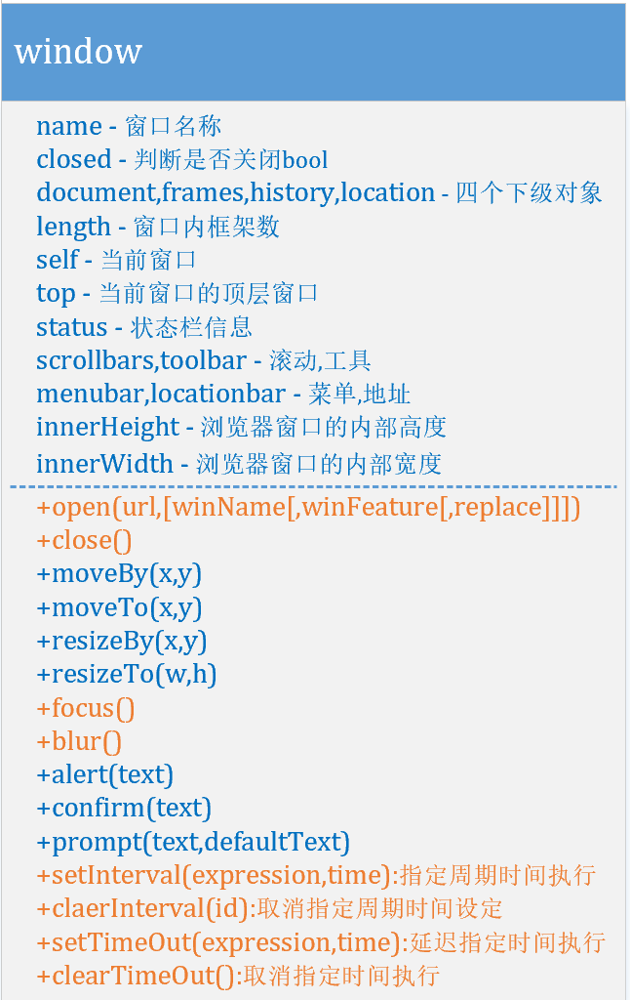|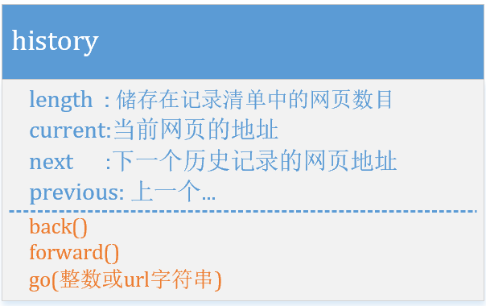 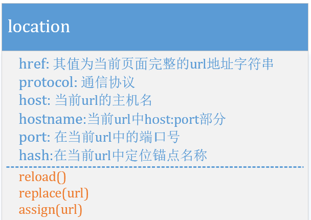

##### 8.2.1 window对象
        Window对象是每个窗口或者框的顶层对象，而且document、location及history是它的子对象。
        windows对象的常用属性
            window.innerHeight - 浏览器窗口的内部高度
            window.innerWidth - 浏览器窗口的内部宽度
        Window对象的方法
            window.open(url,[winName[,winFeature[,replace]]]) - 打开新窗口
                window.open ('page.html','newwindow','height=100,width=400,top=0,left=0,toolbar=no,menubar=no,scrollbars=no, resizable=no,location=no, status=no') 
                脚本运行后，page.html将在新窗体newwindow中打开，
                宽为100，高为400，距屏顶0象素，屏左0象素，无工具条，无菜单条，
                无滚动条，不可调整大小，无地址栏，无状态栏。请对照。
            window.close() - 关闭当前窗口
            window.moveTo() - 移动当前窗口
            window.resizeTo() - 调整当前窗口的尺寸
            alert(message) - 在对话框中显示message消息。
            confirm(message) - 在有OK和Cancle按钮的对话框中显示Message。
            prompt(message,response) - 在带有文本输入框的窗口中显示message。
            setTimeout(expression,time) - 在time之后计算expression，time的单位是毫秒。
            clearTimeout(name) - 用名字取消实现暂停。
            setInterval(expression,time) - 可按照指定的周期（以毫秒计）来调用函数表达式。每隔time
            clearInterval(name)：暂停。

##### 8.2.2 history对象
    window.history 对象包含浏览器的历史。
        history.back() - 与在浏览器点击后退按钮相同
        history.forward() - 与在浏览器中点击按钮向前相同

##### 8.2.3 location对象
    window.location 对象用于获得当前页面的地址 (URL)，并把浏览器重定向到新的页面。
        location.href 属性返回当前页面的 URL。
        location.assign() 方法加载新的文档。
            window.location.href="http://www.baidu.com";

##### 8.2.4 screen对象
    window.screen 对象包含有关用户屏幕的信息
        screen.availWidth - 可用的屏幕宽度
        screen.availHeight - 可用的屏幕高度

