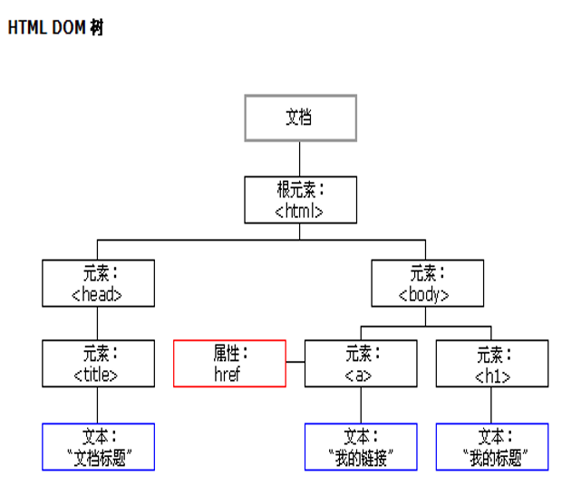
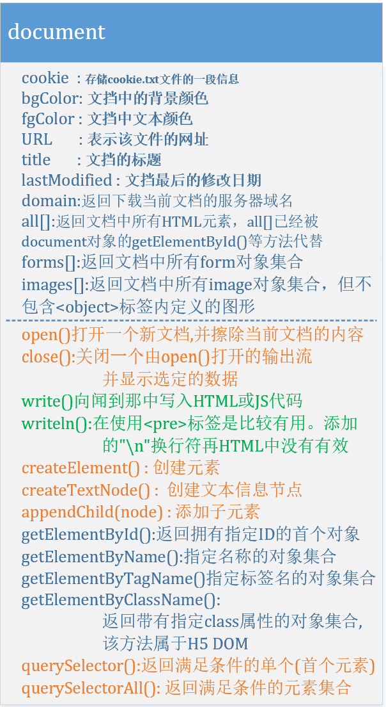
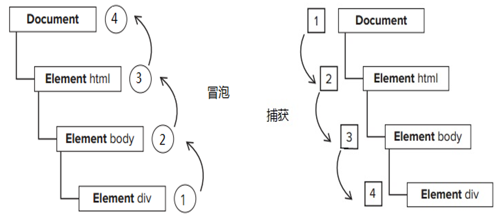

### 第9章 DOM

#### 8.3 DOM对象
    当网页被加载时，浏览器会创建页面的文档对象模型（Document Object Model）。
        HTML DOM 可以以对象的树状结构表示。
结构树                 |        对象属性方法
:---------------------:|:---------------------:|
 | 

    通过可编程的对象模型，JavaScript 获得了足够的能力来创建动态的 HTML。
        • JavaScript 能够改变页面中的所有 HTML 元素
        • JavaScript 能够改变页面中的所有 HTML 属性
        • JavaScript 能够改变页面中的所有 CSS 样式
        • JavaScript 能够对页面中的所有事件做出反应

##### 8.3.1 DOM的Document对象
    i. document对象也是window对象的子对象，是指在浏览器窗口中显示的内容部分，
    可以通过window.docuement访问。当页面包含框架时，
    可以通过document.frames[n].document来访问框架中的对象，
        其中n是当前窗口再框架集中的索引号
        .document常用的属性有body、title、cookie、URL属性以及all[ ]、forms[ ]、images[ ]等集合属性
    
    ii. 如何获取HTML中的内容
        通过标签名找到 HTML 元素
            document.getElementsByTagName()
        通过 id 找到 HTML 元素
            document.getElementById()
        通过 name 找到 HTML 元素
            document.getElementsByName()
        文本框input、buttom等表单控件的值使用value属性获取，
        而p、div、td等文档结构标签的值使用innerHTML或innerText属性获取。

    iii. 改变HTML元素
        如何改变HTML中的内容
            document.getElementById(id).innerHTML=new HTML；
            document.getElementById(id).text=new Text；
        如何改变HTML元素的属性
            document.getElementById(id).attribute=new value
        如何改变 HTML 样式
            document.getElementById(id).style.property=new style
    iv. 创建新的HTML元素
        示例：
            a. 创建新的p元素
                var pElement=document.createElement('p);
            b. 创建一个带文本的p元素
                var node=document.createTextNode("这是新段落。");
                para.appendChild(node);
            c. 创建一个带子元素的块元素div
                var element=document.getElementById("div1");
                element.appendChild(para);
            d. 删除已有的HTML标签
                假如div中拥有两个p，希望从div1中删除p1，需要分别找到父子两个元素
                    

                        
这是一个段落。

                        
这是另一个段落。

                    

                找到div1和p1
                    var parent=document.getElementById("div1");
                    var child =document.getElementById('p1');
                从父元素中删除
                    parent.removeChild(child);

##### 8.3.2 DOM的Event对象
    event 代表事件的状态, 触发event事件的元素、鼠标位置和状态、按键
    event 对象只在事件发生的过程中才有效
    event 的某些属性只对特定的事件才有意义。例如fromElement和toElement只对鼠标事件有意义
    i. 键盘的状态
        keyCode 
            作用：检测键盘事件相对应的内码。 按键的值为 keyCode
            适用：onkeydown, onkeyup, 和 onkeypress 事件。 
            语法： event.keyCode[ = keyCode] 
            可能的值： 这是个可读写的值，可以是任何一个Unicode键盘内码。如果没有引发键盘事件，则该值为 0 。
        Ctrl键的状态：ctrlKey 
            描述：检查ctrl键的状态。 
            语法： event.ctrlKey 
            可能的值： 当ctrl键按下时，值为 TRUE ，否则为 FALSE 。只读。 
        Alt键的状态：altKey 
            描述：检查alt键的状态。 
            语法：event.altKey 
            可能的值： 当alt键按下时，值为 TRUE ，否则为 FALSE 。只读。 
        Shift键状态：shiftKey 
            描述：检查shift键的状态。 
            语法： event.shiftKey 
            可能的值：当shift键按下时，值为 TRUE ，否则为 FALSE 。只读。 

    ii. 鼠标的状态
        button :检查按下的鼠标键。 
            可能的值： 
                0 按左键 
                1 按中间键
                2 按右键 
                3 按左右键 
                5 按左键和中间键 
                6 按右键和中间键 
                7 按所有的键 
            这个属性仅用于onmousedown, onmouseup, 和 onmousemove 事件。
            对其他事件，不管鼠标状态如何，都返回 0（比如onclick）。

    iii. 位置坐标
        窗口坐标 (clientX,clientY)
            返回鼠标在窗口客户区域中的X坐标、Y坐标。 
            语法： event.clientX   event.clientY 
            注释： 这是个只读属性。这意味着，你只能通过它来得到鼠标的当前位置，却不能用它来更改鼠标的位置。 
        局部坐标: (offsetX   offsetY) 
            检查相对于触发事件的对象，鼠标位置的水平坐标、垂直坐标。 
            语法： event.offsetX   event.offsetY
        屏幕坐标 (screenX  screenY)
            描述：检测鼠标相对于用户屏幕的位置 
            语法： event.screenX   event.screenY
            注释： 这是个只读属性。这意味着，你只能通过它来得到鼠标的当前位置，却不能用它来更改鼠标的位置。 

    iv. 产生事件的元素
        鼠标离开的元素 : fromElement 
            描述： 检测 onmouseover 和 onmouseout 事件发生时，鼠标所离开的元素。
            语法： event.fromElement 
            注释： 这是个只读属性。
        鼠标进入的元素 ： toElement 
            描述： 检测 onmouseover 和 onmouseout 事件发生时，鼠标所进入的元素。
            语法： event.toElement 
            注释： 这是个只读属性。 
        触发事件的元素 ： srcElement 
            描述： 返回触发事件的元素。只读。
            语法： event.srcElement 

##### 8.3.3 DOM的Element对象
    HTML DOM Element 对象表示任意的 HTML 元素。
    元素对象可以拥有类型为元素节点、文本节点、注释节点的子节点。
    NodeList 对象表示节点列表，比如 HTML 元素的子节点集合。元素也可以拥有属性，属性是属性节点。

    示例：利用Element对象的属性，可以帮助我们遍历文档元素和节点。
        例如：使用parentNode属性，获取父元素。
            <form id="form">
                

                    

                        <input type="button" value="删除" 
                            onClick="deleteMe(this. parentNode .parentNode);">
                    

                

            </form>
            所谓parentNode就是其上一层节点，里面的this.parentNode就是divB,
            而this.parentNode.parentNode就是divA。
        例如：使用firstChild和lastChild获取子元素。
            

                

            

            
            输出div1的第一个和最后一个子节点，结果是#text，也就是文本节点，而不是设想中的DIV节点。
            这是由于节点前后有空格造成的。

##### 8.3.4 DOM的attribute对象

#### 8.4. DOM与事件
##### 8.4.1 事件的绑定方式
    1.HTML的DOM元素支持onclick、onchange等以on开头的属性，可以直接在这些属性值中编写JavaScript代码。
    例如：当点击div的时候，下面的代码会弹出div的id。
        

        此处，onclick属性中的this代表的是当前被点击的DOM对象，所以我们可以通过this.id获取DOM元素的id属性值。
        这种做法的缺点是，因为代码都是放在字符串里的，不能格式化和排版，当代码很多的时候很难看懂。
    2.当代码比较多的时候，可以在onclick等属性中指定函数名。
        
        

        在事件处理函数中的this代表的是Window对象，而在onclick属性值中的this，则是代表DOM对象并作为参数传递。
    3.在JavaScript代码中通过DOM元素的onclick等属性绑定。
        var dom = document.getElementById("outsetA");
        dom.onclick = function(){alert("1=" + this.id);};
        dom.onclick = function(){alert("2=" + this.id);};
        这种做法this代表当前的DOM对象。这种做法只能绑定一个事件处理函数，后面的会覆盖前面的。
    4．IE下使用attachEvent/detachEvent函数进行事件绑定和取消。
        attachEvent/detachEvent兼容性不好，IE6~IE11都支持该函数，
        但是FireFox和Chrome浏览器都不支持该方法。
        attachEvent/detachEvent不是W3C标准的做法，所以不推荐使用。
    5.使用W3C标准的addEventListener和removeEventListener。
        语法：addEventListener(type, listener, useCapture) 
        type：事件类型，不含"on"，比如"click"、"mouseover"、"keydown"；
        listener：事件处理函数；
        useCapture：事件冒泡，还是事件捕获，默认false，代表事件冒泡类型。
        例如：
            var dom = document.getElementById("outsetA");  
            dom.addEventListener('click', a, false);       
                function a(){ 
                    alert(this.id);//outsetA 
                }
            事件处理函数中this代表的是DOM对象，不是Window。

        同一个事件处理函数可以绑定2次。
            例如：
            var dom = document.getElementById("outsetA");  
            dom.addEventListener('click', a, false);  
            dom.addEventListener('click', a, true);  
                
            function a()  
            {   
                alert(this.id);//outsetA  
            } 
            当点击outsetA的时候，函数a会调用2次，一次用于事件捕获，一次用于事件冒泡。

            如果绑定的是同一个事件处理函数，并且都是事件冒泡类型或者事件捕获类型，那么只能绑定一次。
            例如：
                var dom = document.getElementById("outsetA");  
                dom.addEventListener('click', a, false);  
                dom.addEventListener('click', a, false); 
                function a()  
                {   
                    alert(this.id);//outsetA  
                }
            当点击outsetA的时候，函数a只会调用1次。
            不同的事件处理函数可以重复绑定。

##### 8.4.2 事件处理函数的执行顺序
        如果给同一个事件绑定多个处理函数，先绑定的先执行。
             
            <body>
                

            </body>
            当点击outA的时候，会依次打印出1、2、3、4。
            注意：我们给outA绑定了多个onclick事件处理函数，也就是直接点击outA触发的事件，
            所以不涉及事件冒泡和事件捕获的问题，即addEventListener的第三个参数在这种场景下，
            没有什么用处。如果是通过事件冒泡或者是事件捕获触发outA的click事件，
            那么函数的执行顺序会有变化。

##### 8.4.3 事件冒泡与事件捕获
        我们知道HTML中的元素是可以嵌套的，如果点击了最内侧的outC，
        那么外侧的outB和outA算不算被点击了呢？
        假如outA、outB、outC都注册了click类型事件处理函数，当点击outC的时候，
        触发顺序是A-->B-->C，还是C-->B-->A呢？

        如果浏览器采用的是事件冒泡，那么触发顺序是C-->B-->A，由内而外，像气泡一样，从水底浮向水面；
        如果采用的是事件捕获，那么触发顺序是A-->B-->C，从上到下，像石头一样，从水面落入水底。

        可以通过addEventListener(type, listener, useCapture)的useCapture来设定，
        useCapture=false代表着事件冒泡，useCapture=true代表着采用事件捕获。
        例如：
        function closeWin() {
            if (confirm("确定关闭?")) {
                window.opener=null;
                window.open("","_self");
                this.close();
            }
        }
            
        使用的是事件冒泡，当点击outC的时候，打印顺序是3-->2-->1
        如果将false改成true使用事件捕获，打印顺序是1-->2-->3