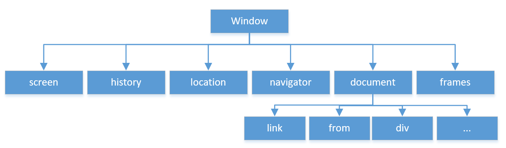
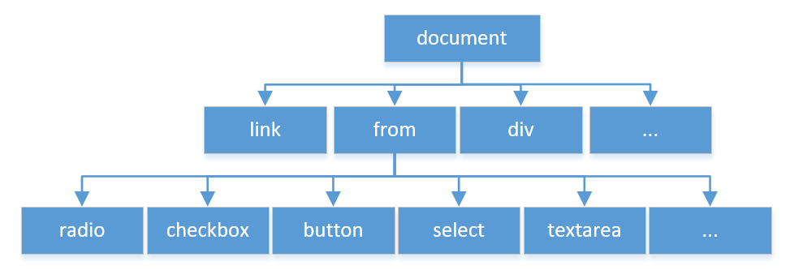

### 8.BOM和DOM编程

#### 8.1 BOM和DOM模型
##### 8.1.1 BOM模型
    a. 浏览器对象模型(Browser Object Model,BOM)定义了JS操作浏览器的接口，
    提供了与浏览器窗口的交互功能，如获取窗口大小，版本信息，浏览历史记录等。
    b. 如下图，BOM是用于描述浏览器对象中对象和对象之间层次关系的模型，
    提供了独立于页面内容并能够与浏览器窗口进行交互的对象结构。
    c. 其中顶层对象为window，其他对象都是其子对象。当浏览页面时，
    浏览器会为每个页面自动创建下图中的各个对象

对象类别|作用
:--------:|:--------:|
window|是BOM模型中的最高一层,通过windows对象的属性和方法来实现对浏览器窗口的操作
document|是BOM的核心对象,提供了访问HTML文档对象的属性、方法和事件处理
location|包含了当前页面的URL地址，如协议，主机名，端口号和路径等信息
navigator|包含与浏览器相关的信息，如浏览器类型和版本等
history|包含历览器历史访问记录，如访问过的URL、访问数量信息等

##### 8.1.2 DOM模型
    a. 文档对象模型(Document Object Model,DOM)属于BOM的一部分，
    用于对BOM中核心对象document进行操作，DOM是一种与平台、语言无关的接口，
    允许程序和脚本动态地访问或更新HTML以及XML文档的内容、结构和样式，
    且提供了一些列的函数和对象来实现访问、删除、修改和添加等操作
    b. HTML文档是一种结构化的文档，通过DOM技术不仅可以操作HTML。
    页面内容，还可以控制HTML页面的风格样式。

##### 8.1.3 事件机制
    a. JS采用事件驱动的响应机制，在用户页面上进行交互操作时会触发相应的事件。
    当事件发生时，系统调用JS中指定的事件处理函数进行处理。事件产生于响应都是由浏览器来完成，
    HTML中设置那些元素响应哪些事件，JS告诉浏览器如何处理这些响应事件。
    b. JS事件分为两大类：
        § 操作事件：用户在浏览器中操作所产生的事件。
            □ 鼠标事件(Mouse Events)、
            □ 键盘事件(Keyboard Events)、
            □ 表单及表单元素事件(Form & Element Events)：表单的提交、重置和表单元素的改变、选取、获取/失去焦点
        § 文档（页面）事件：文档本省所产生的事件，如页面加载完毕，页面卸载，关闭页面窗口，
    c. 对HTML元素的绑定事件的方式包括HTML元素的属性绑定和JS脚本的动态绑定
        i. 属性绑定：在HTML标签内使用以on开头的某一事件处理函数进行绑定
        ii. JS脚本绑定：获取文档中的某一对象，然后通过on口头的事件绑定指定的事件处理函数

#### 8.2 window对象
##### 8.1.2 window的属性
##### 8.1.2 window的方法
方法|示例
:---------:|:---------:|
open()方法:|        1.open(url,name,features,relace);   var newWindow=window.open("http://www.baidu.com","弹出广告","width=1300,height=400,toolbar=no,menubar=no,location=no,status=no,resizable=yes");
close()方法:|     newWindow.close();
setTimeout()方法:|        var id_Of_timeout=setTimeout(code,millisec);
clearTimeout()方法:|        clearTimeout(id_Of_timeout);
setInterval()方法:|        var id_Of_Interval=setInterval(code,millisec);
clearInterval()方法:|        clearInterval(id_Of_Interval);
#### 8.3 location,history,navigator对象
##### 8.3.1 location对象
##### 8.3.2 history对象
##### 8.3.3 navigator对象

#### 8.6 document对象
##### 8.6.1 document的属性
	document对象也是window对象的子对象，是指在浏览器窗口中显示的内容部分，
	可以通过window.docuement访问。当页面包含框架时，可以通过document.frames[n].document来访问框架中的对象，
	其中n是当前窗口再框架集中的索引号.document常用的属性
	有body、title、cookie、URL属性以及all[ ]、forms[ ]、images[ ]等集合属性
属性|描述|
:--------:|:--------:|
body|       提供对body元素的直接访问。对于定义了框架集的文档，该属性引用最外层的frameset元素
cookie|     设置和查询当前文档有关的所有cookie
referrer|   返回载入当前文档的URL(即上一个页面的URL)
URL|        返回当前文档URL
lastModified|   返回文档最后被修改的日期和时间
domain|     返回下载当前文档的服务器域名
all[]|      返回文档中所有HTML元素，all[]已经被document对象的getElementById()等方法代替
forms[]|    返回文档中所有form对象集合
images[]|   返回文档中所有image对象集合，但不包含<object>标签内定义的图形

    特别注意：
    a. referrer属性：返回加载了当前文档的URL地址。
    b. cookie属性：
    是浏览器客户端保存的用户访问服务器时的会话信息，该信息允许服务端访问。cookie的本质是一个字符串
    document.cookie=cookieStr;其中cookieStr保存cookie值时，需要注意以下几项：
        · cookie大小在4KB以内
        · cookie:通过键值对构成，需要根据cookieName来检索cookie中的信息，包括expires、path、domain
        · expires:cookie的过期时间，UTC格式，可以通过Date.toGMTSting()方法生成。
	cookie过期就会被删除。默认情况关闭浏览器，cookie即失效
        · path:允许访问cookie的路径，只有在此路径下的页面才能读写该cookie,一般情况下path=’/‘。同一站点所有页面下均可访问
        · domain:表示域，可以使浏览器确定哪些cookie能够被提交
        · cookie的编码：当cookie中含有空格、分号、逗号等特殊符号需要escape()进行编码，读取时再通过unescape()解码

##### 8.6.2 document的方法
    a. 对文档流的操作：
        · write()、writeln()、open()、close()方法
    b. 对文档元素的操作：
        · getElementById()方法
        · getElementByName()方法
        · getElementByTagName()方法
        · getElementByClassName()方法
        · querySelector()方法
        · querySelectorAll()方法
    c. 方法应用表
方法|描述
:--------:|:--------:|
open()|     打开一个新文档，并擦除当前文档的内容
write()|    向闻到那中写入HTML或JS代码
writeln()|  在使用&lt; pre &gt;标签是比较有用。添加的"\n"换行符再HTML中没有有效
close()|    关闭一个由open()打开的输出流，并显示选定的数据
getElementById()   getElementByName()  getElementByTagName()  getElementByClassName() | 返回一个拥有指定ID的首个对象 返回带有指定名称、指定标签名的对象集合 返回带有指定class属性的对象集合,该方法属于H5 DOM
querySelector()|    返回满足条件的单个(首个元素)
querySelectorAll()| 返回满足条件的元素集合

#### 8.7 Form对象
属性|描述
:--------:|:--------:|
element[] | 返回包含表单中所有元素的数组,元素在数组中的顺序与在表单中出现的顺序相同,每个元素都有一个type属性,即元素的类型
enctype   | 设置或返回用于编码表单内容的MIME类型,默认值是"application/x-www-form-urlencoded",当上传文件时"multipart/form-data"
target    | 可设置或返回在何处打开表单中action-URL。可以是_blank、_self、_parent、_top
method    | 设置或返回用于表单提交提交的HTTP方法
length    | 用于返回表单中元素的数量
action    | 设置或返回表单的action 属性
name      | 返回表单的名称

    表单 id位myform的 四种获取表单中元素的方式：
        var userName = document.getElementById('userName');
        var userPwd = document.myform.userPwd;
        var userPhone = document.forms[0].elements[2];
        var userEmail = document.forms[0].userMail

#### 8.8 Table对象
Table对象的属性
属性|描述
:---------:|:---------:|
row[]      |返回表格中所有行(TableRow对象)的一个数组集合，包括<thead>、<tfoot>、<tbody>中定义的所有行
cells[]    |返回表格中所有单元格(TableCell对象)的一个数组集合
border     |设置或返回表格边框的宽度(以像素为单位)
caption    |设置或返回表格的caption元素
width      |设置返回表格的宽度
cellpadding|设置或返回单元格边框与单元格内容之间的间距
cellSpacing|设置或返回在表格中的单元格之间的间距

Table对象的方法
方法|描述
:--------------:|:---------------:|
createCaption() |在表格中获取或创建<caption>元素
createTFoot()   |在表格中获取或创建<tfoot> 元素
createTHead()   |在表格中获取或创建<thead> 元素
insertRow()     |在表格中插入一新行，新行将被插入到index所在的行之前,index不在正确行数范围内,报错
deleteCaption() |在表格中获取或删除<caption>元素及其内容
deleteTFoot()   |在表格中获取或删除<tfoot> 元素
deleteTHead()   |在表格中获取或删除<thead> 元素
deleteRow()     |从表格中删除指定位置的行

TableRow对象的属性
属性|描述
:--------------:|:---------------:|
cells[]         | 返回当前行所包含的单元格数组
sectionRowIndex | 返回某一行在tBody、tHead或者tFoot中的位置
rowIndex        | 返回某一行在表格的行集合中的位置 
innerHTML       | 设置或返回表格行的开始和结束标签之间的HTML内容

TableRow对象的方法
属性|描述
:-----------:|:-----------:|
insertCell() | 在HTML表的一行的指定位置插入一个空的<td>元素
deleteCell() | 删除表格中的单元格

TableCell对象的属性
属性|描述
:-----------:|:-----------:|
width  | 设置或返回表元的宽度
rowSpan| 设置或返回表元横跨的行数

width  | 设置或返回表元的宽度
rowSpan| 设置或返回表元横跨的行数

#### 8.9 DOM节点

#### 8.10 事件处理
	JS采用事件驱动的响应机制，用户在页面上进行交互操作会触发响应的事件。
	事件驱动是指页面中响应用户操作的一种处理方式，而事件处理是指页面在响应用户操作时所调用的程序代码。
	事件的产生于响应都是由浏览器来完成的，包括HTML代码中设置哪些元素响应哪些事件，JS告诉浏览器如何处理这些响应事件

##### 8.10.1 事件流和事件对象
    a. DOM事件流：
        也称事件传播过程，亦即，在树形的DOM结构中，其中一个HTML元素产生一个事件时，
	事件会在元素节点与根节点之间按特定顺序传播，路径经过的节点都会收到该事件。
    b. 事件流顺序的两种类型：
        · 事件冒泡(Event Bubbling):从叶子节点沿祖先节点一直传递到根节点。
	事件从特点的目标到最不特点的事件目标传播.
        · 事件捕获(Event Capturing)：从顶层元素一直传递到最精确的元素
    c. Event对象提供：
        · prevetDefault()方法，用以通知浏览器不再执行与事件关联的默认动作，
        · stopPropagation()用于终止事件的进一步传播

##### 8.10.1 鼠标事件
事件|含义
:---------:|:---------:|
onclick|        单机
ondblclick|     双击
onmouseover|    按下
onmouseout|     松开
onmousemove|    移动
onmousedown|    移出
onmouseup|      悬停

##### 8.10.1 键盘事件
事件|含义
:---------:|:---------:|
window.onkeypress|  在键盘按键被按下并释放一个键时触发事件
window.onkeydown|   在用户按下一个按键时触发
window.onkeyup|     在键盘按钮送开始触发

##### 8.10.1 文档事件
事件|含义
:---------:|:---------:|
window.onload	|在页面或图像加载完成后立即触发事件
window.onunload	|在用户推出页面时触发事件
window.onresize	|在窗口和框架被调整大小时触发事件

计算按键|键码|功能按键|键码|控制按键|键码|控制按键|键码
:-----:|:--:|:-----:|:--:|:-----:|:--:|:-----:|:---:|
0      |96  |F1     |112 |BackSpace |8 |right Arrow |39
1      |97  |F2     |113 |Tab       |9 |Down Arrow  |40
2      |98  |F3     |114 |Clear     |12|Insert      |45
3      |99  |F4     |115 |Enter     |13|Delete      |46
4      |100 |F5     |116 |shift     |16|Num Lock    |144
5      |101 |F6     |117 |control   |17|;:          |186
6      |102 |F7     |118 |Alt       |18|=+          |187
7      |103 |F8     |119 |Cape Lock |20|-_          |189
8      |104 |F9     |120 |ESc       |27|.>          |190
9      |105 |F10    |121 |Spacebar  |32|/?          |191
乘     |106 |F11    |122 |Page Up   |33|`~          |192
加     |107 |F12    |123 |Page Down |34|[{          |219
Enter  |108 |*      |*	 |End       |35|/加竖线     |220
减     |109 |* 	   |*	|Home      |36|]}          |221
点     |110 |*      |*   |Left Arrow|37|* 	   |*
除     |111 |*      |*   |Up Arrow  |38|*      	   |*

##### 8.10.1 表单及其元素事件
事件|描述
:------:|:------:|
onblur	|在对象失去焦点时触发事件
onfocus	|在对象获取焦点时触发事件
onchange	|在域的文本内容改变时触发事件
onselect	|在文本框的文本被选中时触发事件
onreset	    	|在表单中的重置按钮被单击时触发事件
onsubmit	|在表单中的确认按钮被单击时触发事件

