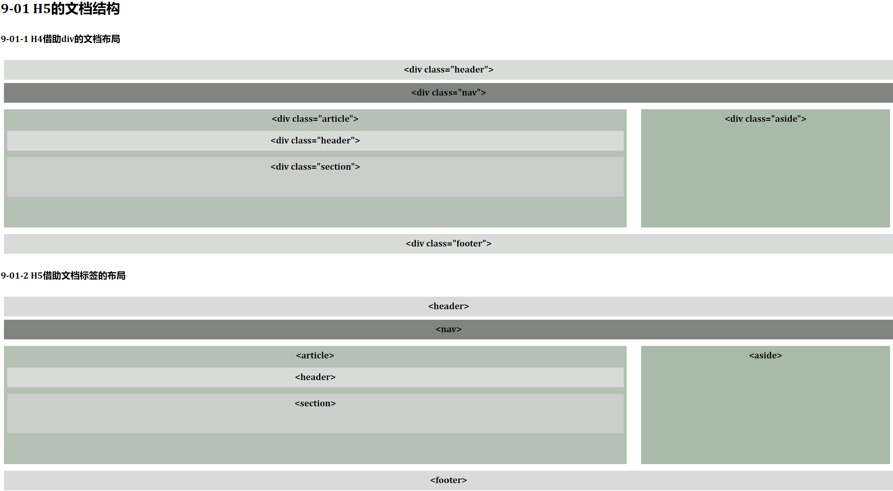

### 9.HTML5基础

#### 9.1 HTML5概述
    HTML5能够统一的网站显示效果，无论是笔记本、台式机还是智能手机，都可以非常方便的浏览基于HTML5的网站。
##### 9.1.1 HTML5发展史
    HTML经历了2.0、3.2、4.0到4.01版本，业内普遍认为已经走到尽头，Web标准的焦点也从HTML转向了XML和XHTML
    2004年为了推动HTML5标准，由Opera、Apple、Google、Mozilla等浏览器厂商共同组织了WHATWG。
    2006年W3C停止了XHTML2.0标准的制定加入了WHATWG的合作项目，并于2008年发布了HTML5的工作草案
    2010年1月，YouTube开始提供HTML5播发器；4月，苹果公司乔布斯宣布封杀Flash,关注HTML5.自此H5作为Web新标准大放异彩。
    
##### 9.1.2 HTML5优势
    其新技术特征主要表现为一下方面：
特点|说明
:-----------:|:-----------:|
语义特性      | 通过页面标签，更好的实现HTML的结构化和语义化
本地存储      |
访问设备      | 在重力感应上通过Orientation API访问;在定位上通过Geolocation API 访问;在音频方面可以访问麦克风摄像头
通信特性      | 通信能力的增强使得基于页面的聊天程序实时性更高,游戏体验更流畅,H5拥有更有效的服务器推送技术，  Server-Sent Events和Web Socket使得客户端和服务器之间的通信效率达到了前所未有的高度
多媒体新特性   | 可以在浏览器中直接访问音频和视频
三维及图形特性 | SVG、Canvas、WebGL、CSS3中的3D功能使得渲染变得高效方便，在生成图表、2D/3D游戏方面应用广泛
性能和集成特性 | Web Wroker的出现,使得浏览器支持多线程和后台任务处理,XMLHttpRequest(level 2)提供了跨域请求与表单操作的简便方案
CSS3特性      | 圆角、半透明、阴影、渐变、多背景图及强大的选择器、变形动画等新特性,轻松实现页面中的各种特效。
移动端特性　　 | 能够在不同的系统平台上运行且呈现统一的效果.H5对屏幕的适配性好,能够以一套代码和资源适配多种手机屏幕，  对旋转不需太多处理。音频视频自由嵌入，GPS、WiFi及定位精准且灵活，推动LBS应用发展

#### 9.2 HTML5语法特征
    i. HTML5标记方法
        A. DOCTYPE声明
            a. 下述定义表示采用HTML4.01的过度版本。同时XHTML是区分大小写的所以html要小写
                <!DOCTYPE html PUBLIC "-//W3C//DTD XHTML 4.0 Transitional//EN" 
                "http://www.w3.org/TR/xhtml4/DTD/xhtml1-transitional.dtd">            
            b. 在HTML5中，已经不再需要可以声明版本了，因为W3C希望一份html代码使用所有的HTML版本，
                代码更加简洁，通用即：<!DOCTYPE html>
        B. 指定字符编码
            a. HTML4中,通过meta标签制定文档中的字符编码格式         
                <meta http-equiv="Content-Type" content="text/html;charset=UTF-8">
            b. H5中,<meta charset="UTF-8">
    ii. HTML5语法差异
        A. 标签不区分大小写
        B. 结束标签可以省略
            a 空元素
            b 结束标签省略
            c 开始和结束标签同时省略
        C. boolean属性的设置
        D. 属性的引号允许省略,但属性值内不能出现空格

#### 9.3 HTML5文档、表单、标签

##### 9.3.1 文档结构元素
HTML文档标签
文档标签              | 说明
:--------------------:|:---------------------:|
&lt;article&gt;标签   |	用于表示文档、页面或应用程序中独立的，完整的、可以独自被外部引用的内容。该内容可以是一篇文章、短信、帖子或评论
&lt;header&gt;标签    |	定义文章的页眉信息，其中包含多个标题(h1-h6)、nav(导航部分)、p、span等标签
&lt;hgroup&gt;标签    |	用于网页和区段(section)的标题组合.当header中有多个标题时，可使用hgroup将标题组成一组
&lt;nav&gt;标签       |	用于定义页面中的各种导航。页面中可以拥有多个nav元素作为不同的内容导航；常见的导航有顶部导航、侧边栏导航、页内导航和翻页导航等。
&lt;section&gt;标签	  |   用于文章的内容进行分块，如章节、页眉、页脚或文档的其他部分。 该标签通常包含一个标题；标签中可以包含多个article标签  可以嵌套section标签，表示该分块中包含多个子分块。 当对页面容器设置样式时，尽量采取div标签，而不是section标签  
&lt;aside&gt;标签	  |   专门用于定义当前页面或当前文章的附属信息，包括当前页面或者当前文章相关引用，侧边栏，广告以及导航等有别于主题内容的部分
&lt;footer&gt;标签	  |   用于定义脚注部分，包括文章的版权信息，作者授权等信息

文档元素中article、section、div的区别
类型         |   说明
:----------:|:----------:|
article     |  article可以看成一种特殊的section，但比section更强调独立性，当一块内容想读独立时用
section     |  当需要对一块内容分成几段时，使用section标签
div         |  作为H5的另一种容器，通过div标签进行一个总体的CSS样式套用		

##### 9.3.2 form表单及标签属性
    i. form新增H5属性
属性	      |       描述
:------------:|:------------:|
autocomplete  | 设置表单是否自动完成功能。取值可以是on或off。使用on时，当再次输入文本时，输入框会根据之前输入内容进行提示。
novalidate	  | 设置表单提交时是否进行验证，使用该属性时，表单提交时忽略表单验证
##### 9.3.3 input新增标签类型及验证
    i. input新增H5属性
属性	        |   描述
:--------------:|:--------------:|
form	        |   为表单元素指定关联的表单：如下goodsType表单在form之外又想从属form，所以使用form属性
formaction	    |   让按钮自身控制表单提交的URL
formenctype	    |   让按钮动态的改变enctype属性
formmethod	    |   让按钮动态的设置表单的提交方式
formtarget	    |   让让按钮动态设置表单的target属性
formnovalidate	|   设置当前元素是否采用HTML5表单验证
autofocus	    |   设置在页面加载时是否获得焦点。一个页面只能有一个表单元素具有autofocus属性，不可滥用
placeholder	    |   设置文本框未输入且未获得焦点时，显示的而输入提示信息
list	        |   引用预定义的datalist，类似缓存功能
multiple	    |   允许一个以上的值
required	    |   输入的字符按不能为空
attern	        |   规定输入字段的值需要符合指定的模式				

    ii. input新增H5标签类型
类型	    |     描述
:----------:|:---------:|
email	    |   创建一个email输入框，并检查其内容是否符合email格式     required: email标签内容允许为空，除非加上required，提交时会检查格式     multiple: 允许email文本框中同时输入多个email地址，地址之间通过逗号隔开
url	        |   创建一个url输入框并检查其内容是否符合url格式，例如协议，主机是否缺失等    
number	    |   创建一个只输入数字的文本框，和rang功能基本一样，只在外观有差异    max: 设置可输入的最大值   min: 设置可输入的最小值   step: 设置属性之间的合法步长，默认补偿为 1
range	    |   生成一个拖动条，只允许输入一定范围内的数值，默认值0-100范围，range和number功能基本一样    
datePickers	|   日期与时间的输入文本框，其类型包括date，datetime-local，month、week、time等。这五种分别表示选择年月日；年月日时分；年周；年月；时间    
color	    |   颜色选择文本框，其值为#FFFFFF格式的文本
search	    |   专门用于搜索关键字的文本框，多用于手机客户端

    iii. 验证	
    H5中提供的表单验证相对较简单、易用、但不够灵活，有些浏览器提供的提示信息也不够明确。
    为此H5提供了checkValidity()和setCustomValidity()方法，用以自动逸表单验证
        A. checkValidity()
        该方法用于检测表单中某个输入是否有效，并返回一个bool值，可以验证表单及表单元素，默认情况下表单提交时调用该方法，根据返回值决定是否提交表单。开发人员可更具实际情况对元素进行验证
        B. setCustomValidity()
        该方法提供开发人员“定制”自己的错误提示信息。调用该方法时表单将处于未通过验证状态。

##### 9.3.4 otherElements
下面是HTML5其他标签的用法，以及各浏览器对其他标签的支持情况
标签                |           描述                                      |  不支持的浏览器
:------------------:|:--------------------------------------------------:|:----------------:|
&lt;datalist&gt;	|   用于定义输入备选的选项列表，类似缓存，于text配合使用  |  IE、Safari
&lt;details&gt;	    |   用于描述文档或文档某个部分的细节	                 |   IE、FireFox、Opera
&lt;summary&gt;	    |   用于包含details的标题部分	                        |   IE、FireFox、Opera
&lt;mark&gt;	    |   用于定义带有标记的文本	                            |   IE9之前不支持
&lt;meter&gt;	    |   用来度量给定范围内的数据	                        |   IE
&lt;progress&gt;	|   用于标识任务的进度(进程)	                        |   IE10之前支持
&lt;ruby&gt;	    |   用于定义注释、中文注音或字符	                     |   IE9之前不持支
&lt;rt&gt;	        |   与ruby一起使用，提供注释、中文注音和字符的发音	      |    IE9之前不支持
&lt;rp&gt;	        |   在ruby中使用，当浏览器不支持时ruby时显示此中内容	  |    IE9之前不支持
&lt;time&gt;	    |   提供一个公历时间，搜索引擎依据此搜索更智能	不会在任何浏览器中呈现特殊效果

#### 9.5 HTML5拖放事件
    HTML5拖放（draggable）API（实现拖放的一系列编码方法）
    i. 拖放是在H5中提供的技术。通过拖放功能方法(API)可以让页面中的任意元素变得可拖动，便于人机交互。
        □ 通过为元素添加draggable属性，并将其设置为true，实现当前元素允许拖放。
        □ 通过ondragstart等事件绑定监听器，并在监听器中设置所携带的数据，完成实际可见的拖放效果。

    ii. 拖放时可触发的事件
事件	    |                事件源             |  	描述
:----------:|:--------------------------------:|:--------------------------------:|
ondragstart	| 被拖动的HTML元素	                | 开始拖动元素时触发该事件
ondrag	    | 被拖动的HTML元素	                | 拖动元素过程中触发该事件
ondragend	| 被拖动的HTML元素	                | 拖动元素结束时触发该事件
ondragenter	| 拖动时鼠标进入的目标元素	         | 被拖动的元素进入目标元素的范围时触发该事件
ondragleave	| 拖动时鼠标所离开的元素	         | 被拖动的元素离开目前元素的范围内时触发该事件
ondragover	| 拖动时鼠标所经过的元素	         | 在所经过的元素范围内，拖动元素时会不断的触发该事件
ondrop	    | 停止拖动时鼠标所释放的而目标元素    | 被拖拽的元素释放到当前元素中时，会触发该事件

    iii. dataTransfer对象：用于被拖动元素向目标元素传递数据
属性            |       描述
:--------------:|:--------------:|
dropEffect	    |  设置或返回允许的操作类型，可以是none、copy、link、move。操作类型不是effectAllowed属性允许的类型，操作会失败
effectAllowed	|  设置或返回被拖放元素的操作效果类别。可以是none、copy、copyLink、copyMove、link、linkMove、move、all或者uninitialized
items	        |  返回一个包含拖拽数据的dataTransferItemList对象
types	        |  返回一个DOMStringList，包含了存入dataTransfer对象中数据的所有类型
files	        |  返回一个拖拽文件的集合，没有拖拽，该属性为空

#### 9.6任务与上机
[doc](./doc/readme.md '效果展示')