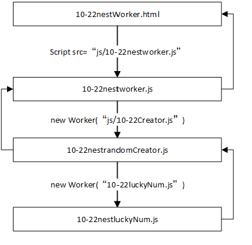

### 10.HTML5进阶

#### 10.1 Canvas绘图
	i. HTML5的canvas标签仅仅是一块白布，并不是图形绘制，界面设计者需要通过JavaScript脚本对齐进行绘制。
    该标签的属性与其他HTML标签的属性没有太大区别，通过id属性设置ID名，style，class指定样式和类，width，height设置大小。hidden指定是否隐藏
		A. 绘制的步骤如下：
            ○ 在页面中定义<canvas>标签，并为其添加width和Height
            ○ 在js脚本中通过getElementById()等方法获得该canvas对象
            ○ 调用canvas对象的getContext()方法,返回一个图像上下文对象(GraphicsContext)，
	    Content提供了getcontext("2D")返回一个CanvasRenderingContent2D对象，用于绘制二维图形
            ○ 调用CanvasRenderingContent2D响应的绘制方法，实现图形绘制

##### 10.1.1 canvas标签
##### 10.1.2 CanvasRendingContext2D对象
    用来绘制二维图形的对象
	这个对象是通过向canvas.getContext(contextID)方法传递"2d"参数得到的用于绘制二维图形的对象，目前尚不支持3d

##### 10.1.3 绘制图形
    i.矩形区域
        fillRect(x,y,width,height)
    ii.矩形边框
        contextstroke.lineWidth = 15;
        //绘制圆角矩形框
        contextstroke.lineJoin = 'round';
        contextstroke.strokeRect(x,y,width,height);
##### 10.1.4 绘制图像
    i. drawImage方法
    drawImage(image, x, y)
    drawImage(image, x, y, width, height)
    drawImage(image, sourceX, sourceY, sourceWidth, sourceHeight, destX, destY,destWidth, destHeight)

参数               |            含义
:--------------------------:|:--------------------------:|
image                       |所要绘制的图像；
(sourceX,sourceY)           |表示在绘制图像时，从源图像的哪个位置开始绘制；
sourceWidth,sourceHeight    |表示在绘制图像时，需要绘制源图像的宽度和高度；
(destX,destY)               |表示所绘图像区域的左上角的画布坐标；
destWidth,destHeight        |所绘图像区域的宽度与高度。

    绘制图像时使用drawImage经常出现图片加载不出来的情况，即便是使用缩略图有时也无济于事，
    这种情况需要使用img.onload() 函数予以边加载边显示的进行处理，如下所示；    
    img.onload = function () {
        //绘制一幅图像
        context.drawImage(img, 10, 10);
        //绘制一幅图像，并可以调整其宽度与高度
        context.drawImage(img, 120, 10, 80, 120);
        //从原图中进行裁剪，并进行绘制
        context.drawImage(img, 10, 10, width, height, 210, 10, width, height);
        //将裁剪的区域进行放大
        context.drawImage(img, 10, 10, width, height, 310, 10, width * 1.1, height * 1.1);
        //将裁剪的区域进行缩小
        context.drawImage(img, 10, 10, width, height, 410, 10, width * 0.8, height * 0.8);
    }
    ii. 图像平铺
        将图像按照一定的比例缩放后对画布进行平铺。实现平铺的两种方式：
        A. drawImage() 方法循环平铺
        B. 使用createPattern()方法进行平铺
            说明：
                createPattern()方法用于创建一种图像平铺模式，返回一个CanvasPattern对象,
                该对象可用作strokeStyle()或fillStyle的属性值,即可进行图像平铺
            语法：var pattern=createPattern(image, repetitionStyle);
            参数：repetitionStyle表示平铺方式，取值，
                repeat（双向平铺）、repeat-x（x方向平铺）、repeat-y（y方向平铺）、no-repeat（不平铺）
    iii. 像素操作
        A. HTML 5中的Canvas API中提供了像素级的处理技术。在图像中，每个像素都是
            由红（R）、绿（G）、蓝（B）和透明度（A）四部分构成。
            通过对每个像素的RGBA处理来实现图像的颜色变换、透明度调整等效果
            a. 语法：var imgData=context.getImageData(sourceX,sourceY,width,height);
            b. 说明：
                参数sourceX、sourceY分别表示所获取区域的左上角的x、y坐标
                参数width、height分别表示所获取区域的宽度和高度
                返回值imgData是一个CanvasPixelArray对象，具有height、width、data等属性
                data属性是一个保存像素集合的数组，数据格式如“[r1,g1,b1,a1,r2,g2,b2,a2,…]”形式
                像素的个数为data.length/4
        B. 获得图像的像素后，允许对每个像素单独进行处理。
            当像素处理完毕后，再通过putImageData()方法将处理过的像素集合绘制到画布中
            a. 语法: context.putImageData(imgData,x,y,[dirtyX,dirtyY,dirtyWidth,dirtyHeight]);
            b. 说明：
                参数imgData表示需要绘制的像素集合
                参数x、y分别表示所绘图像在画布上的开始位置的x、y坐标
                参数dirtyX、dirtyY（可选），分别表示所绘制图像的开始位置的x、y坐标
                参数dirtyWidth、dirtyHeight（可选），分别表示所绘制图像的宽度和高度

##### 10.1.5 绘制文字
    在Canvas画布中还可以绘制文字，并设置文字的样式、对齐方式和纹理填充等效果
    绘制文字的方法有fillText()和strokeText()方法：
        fillText()方法用于填充方式绘制文字内容，fillText(text,x,y,[maxWidth]);
        strokeText()方法用于绘制文字轮廓，strokeText(text,x,y,[maxWidth]);
    使用font、textAlign、textBaseline属性设置绘制文本的字体、对齐方式以及文本的基线
    shadowBlur、shadowColor、shadowOffsetX和shadowOffsetY属性用来设置文字阴影效果
    textBaseline属性的取值范围为alphabetic（默认）、top、hanging、middle、ideographic和bottom。

##### 10.1.6 绘制路径
    CanvasRenderingContext2D对象中提供了一组方法，用于绘制一组独立的线条（又称子路径），
    这些线条组合到一起构成图形，即路径（Path）绘制图形
    在绘制路径时，画布上的每一条子路径都是以上一条路径的终点作为起点
    路径的绘制方法有beginPath()、closePath()、isPointInPath()、lineTo()、moveTo()、fill()和stroke()等方法
    在绘制路径时，首先获得图形上下文对象Context，然后使用以下步骤进行绘制：
        开始创建路径；
        创建图形路径；
        路径创建完成后，关闭路径；
        设定绘制样式，调用绘制方法，绘制路径

##### 10.1.7 绘制圆弧
	arc()方法使用一个圆点和半径的方式绘制一条圆弧路径；
	arcTo()方法使用使用切点和半径的方式绘制一条圆弧路径。

    A. 语法： arc(x, y, radius, startAngle, endAngle,counterClockWise)
        参数startAngle表示沿着圆指定弧的开始点的角度；
        参数endAngle表示沿着圆指定弧的结束点的角度；
        参数counterClockWise表示弧沿着圆周的逆时针方向（true）还是顺时针方向（false）。

    B. 语法： arcTo(x1, y1, x2, y2, radius)
        其中P0为起始点；
        参数x1、y1分别是点P1的x、y坐标，P0P1为圆弧的切线，P0为切点；
        参数x2、y2分别是点P2的x、y坐标，P1P2为圆弧的切线，P2为切点；
        参数radius表示圆弧的对应半径。

##### 10.1.8 绘制渐变图形
    在绘制图形时,可以使用渐变颜色作为填充色
    当使用渐变颜色作为填充色时，fillStyle属性值为一个渐变的填充对象
    渐变是指在填充时从一种颜色慢慢过渡到另外一种颜色，分为两种方式：
        线性渐变
        径向渐变

    i.  线性渐变
        线性渐变（liner gradient）是指沿着一条直线设定要用的若干颜色，颜色之间形成渐变色
        在绘制线性渐变时，可以通过createLinearGradient()方法来获得一个LinearGradient对象
        语法 var gradient=context.createLinearGradient(xStart, yStart, xEnd, yEnd)
            参数xStart和yStart分别表示渐变的起始点的x和y坐标
            参数xEnd和yEnd分别表示渐变的结束点的x和y坐标

    ii. 径向渐变
        径向渐变（radial gradient）是指沿着圆形的半径方向向外进行扩散的渐变方式
        在绘制径向渐变时，可以通过 createRadialGradient()方法来获得一个RadialGradient对象
        createRadialGradient()方法中分别指定了两个圆的大小和位置，从第一个圆心处开始向外渐变扩散，直到第二个圆的外轮廓为止。
        语法：context.createRadialGradient(xStart,yStart,radiusStart,xEnd,yEnd,radiusEnd)
            参数radiusStart表示起点圆的半径；
            参数radiusEnd表示终点圆的半径。
        当起点圆和终点圆不存在包含关系时，不同的浏览器对渐变处理方式不一致，显示结果也有一定的差异。

##### 10.1.9 图形坐标系变换
    Canvas绘图是以画布的左上角(0,0)作为原点，水平向右为x轴正方向，垂直向下为y轴正方向。
    在绘制图形时，经常会对图形进行旋转或变形处理；
    HTML 5 Canvas API中提供了坐标轴变换处理功能，通过平移、缩放和旋转的方式来实现这些效果。
    i.  平移
	    在CanvasRenderingContext2D对象中，translate()方法用于实现坐标轴原点的移动。
        context.translate(tx, ty)
            参数tx取正数时，表示将坐标原点向右移动tx个单位（默认为像素）；
            参数ty取正数时，表示将坐标原点向下移动ty个单位；
            参数tx、ty取负数时，分别表示坐标原点向左、向上移动相应的单位。
    ii.  缩放
	    在CanvasRenderingContext2D对象中，scale()方法用于将图形放大或缩小。
        context.scale(sx, sy)
            参数sx取值大于1时，表示在水平方向上放大的倍数；
            参数sy取值大于1时，表示在垂直方向上放大的倍数；
            参数sx、sy取值0~1之间时，分别表示在水平方向、垂直方向上缩小的程度。
    iii.  旋转
	    rotate()方法用于以坐标轴原点作为旋转中心对图形进行旋转
        context.rotate(angle)
            参数angle表示旋转的角度；
            参数angle取正数时，表示顺时针方向旋转；
            参数angle取负数时，表示逆时针方向旋转.

#### 10.2 多媒体播放
	H5之前网页播放视频、音频通常需要借助第三方如flash。因需要手动安装，繁琐且易崩溃。
	H5提供了<video/>和<audio/>以及Video和Auido对象，来实现静态播放和动态API功能。	

##### 10.2.1 H5的多媒体支持
    i. HTML5的多媒体标签<video/>和<audio/>
	    使用这两种标签非常简单，只需要指定src，controls等属性即可。语法如下:

属性    |	  描述
:----------:|:----------:|
src 	    | 指定播放的视频或音频的URL地址
autoplay	| 指定视频和音频加载完成后会自动播放
controls	| 指定视频和音频播放时显示播放控制条
loop	    | 指定视频和音频是否重复播放
preload	    | 指定是否预加载视频或音频，取值auto(预先加载)、meta(只载入元数据)、none(不执行加载)；设置autoplay时该属性无效
muted	    | 指定视频和音频是否静音
poster	    | 针对video.设置视频下载时显示的图像，或者用户点击播放按钮前显示的图像
width	    | 针对video.设置视频播放器的宽度
height	    | 针对video.设置视频播放器的高度

    ii. H5的多媒体支持情况
    A. 视频支持情况
    H5支持三种:WebM, Ogg, MP4:(type="video/webm|ogg|mp4")

类型    |       含义
:------:|:------:|
WebM	|具有VP8和Vorbis音频特点，Google对齐致力让其免费
Ogg：	|带有Theora和Vorbis音频特点，目前免费
MP4：	|带有H.264视频编码和ACC音频格式，目前收费

浏览器   |  IE9+   | FireFox |   Opera   |	Chrome   | Safari
:------:|:-------:|:-------:|:---------:|:---------:|:------:|
WebM    |	No	  |  Yes    |	Yes 	|   Yes     |   No
Ogg     |	No    |	 Yes    |	Yes 	|   Yes     |   No
MP4     |	Yes   |	 No     |	No  	|   Yes     |   Yes

    B. 音频支持情况
    H5推荐Ogg Vobis因其免费浏览器支持好. 另外H5也支持MP3,Wav格式，type对应 audio/mpeg|ogg|x-wav
    各浏览器对音频的支持情况如下：
音频格式    |	IE9+  |	FireFox	 |   Opera	|  Chrome  |  Safari
:---------:|:-------:|:--------:|:--------:|:--------:|:--------:|
Ogg Vorbis |	No	 |  Yes 	|   Yes	   |    Yes	  |  No
MP3	       |    Yes  |	No	    |   No	   |    Yes	  |  Yes
wav        |	No   |	Yes	    |   Yes	   |    No	  |  Yes

为了解决浏览器对视频、音频格式的支持，使用<source />标签为视频或音频指定多个媒体源，浏览器可以选择适合自己播放的媒体源。

属性	 |描述
:------:|:------:|
media	|设置媒体资源类型，目前所有浏览器暂不支持该属性
src	    |指定要播放的音视频的URL地址
type	|指定媒体资源的MIME类型，即设定视频type="video/webm|ogg|mp4";音频type=“audio/mpeg|ogg|x-wav”

##### 10.2.2 H5多媒体API
	可以通过Js脚本控制视音频的播放。Video和Audio对象，用于控制音视频会放及当前状态。连个对象属性和方法基本相同，如下

#### 10.3 Web存储
    Web 存储指的是Session Storage 和Local Storage
	iii. Web Storage 技术用于在客户端本地保存数据，有如下两种数据存储形式
		A. Session Storage ，将数据保存在Session对象中，Session是指用户在浏览某个网站时，从进入网站到浏览器关闭所经历的时间，
		即用户浏览该网页所花费的时间。而Session对象则用于保存用户浏览网页这段时间所需要保存的任何数据，
		当用户会话失效时，Session Storage保存的数据也随之丢失
		B. Local Storage，将数据保存在客户端的硬件设备中，当浏览器关闭后，数据仍然存在，
		在下次打开浏览器访问页面时仍然可以继续使用，除非用户显示清除该数据
		C. sessionStorage和localStorage两个对象都是Storage的实例，两者对应的属性和方法基本相同，区别在于保存数据的声明周期不同
    
    在HTML4中浏览器的主要功能是负责HTML内容的呈现，当客户端有少量的数据存储时，需要通过cookie技术实现，Cookie有一下几个缺点：
        A. Cookie的小被限制在4KB以内
        B. Cookie会随着Http请求一起发送到服务器，重复多次的发送会导致带宽的浪费。
        C. Cookie信息在网络传输的过程中并未进行加密，存在一定的安全隐患
        D. Cookie操作相对复杂
##### 10.3.1 Storage接口

##### 10.3.2 Session Storage
##### 10.3.3 Local Storage
    Local Storage较Session Storage保存时间更持久。
	当需要存储复杂数据时，要借助JSON对数据进行封装，然后在进行存储

#### 10.4 本地数据库
    i. HTML5提供了两个与本地存储有关的技术：Web Storage和本地数据库技术
		A. Web Storage存储机制是针对HTML4的Cookie存储机制的一种改善
		B. 本地数据库技术是HTML5中新增的功能，用于在客户端本地创建一个数据库，
        将原来保存在服务器上的数据直接保存在本地客户端，大大减轻服务端压力，提高访问速度
    ii. H4及以前数据库放在服务器端，只能用服务器来访问数据库，现在H5提供了本地数据库技术，大大提高了Web应用程序的性能
		A. SQLite数据库是一种通过SQL语言进行访问的文件型SQL数据库
		B. IndexedDB数据库是一种轻量级NOSQL数据库

##### 10.4.1 SQLite数据库
    A. SQLite是一个开源的嵌入式关系数据库，实现了自包容、零配置和支持事务的SQL数据库引擎
        与其他数据库管理系统不同的是，SQLite的安装和运行非常简单，占用资源也非常低，在嵌入式设备中只需要几百K的内存
        目前已经在很多嵌入式产品中得到应用，如Android、IOS、HTML 5、AirBus、Skype等
    B. 在HTML 5中，通过JavaScript对SQLite数据库进行访问操作的具体步骤如下：
        a. 创建数据库访问对象；
            在创建数据库访问对象时，需要用到openDatabase()方法来创建一个数据库访问对象
            语法：var db=openDatabase(databaseName,version,description,size);
            参数：
                参数databaseName表示数据库的名称；
                参数version表示数据库的版本号；
                参数description表示数据库的描述；
                参数size表示数据库的大小；
                该方法返回一个数据库访问对象；当数据库不存在时，则创建一个新数据库并返回数据库访问对象。
            示例：
                var db=openDatabase("goodsDB","1.0","Walking Fashion E&S Databse",2*1024*1024);
        b. 使用事务处理。
            说明：
                当访问数据库时，使用事务来完成数据库的访问操作，有效避免其他用户同时进行操作所产生的干扰。
                事务分为只读事务和读写事务，只读事务使用readTransaction()方法实现数据的查询操作，
                                          读写事务使用transaction()方法来实现数据更新及表的基本操作。
            语法:
                db.transaction(function(tx){
                    tx.executesql(sqlString,[params],
                        function(tx,rs){
                            //数据操作成功，数据处理
                        },
                        function(tx,error){
                            //数据操作失败，提醒信息
                        }
                    );
                });
            示例：
                db.transaction(function(tx){
                    tx.executesql("select * from goods");
                });

##### 10.4.2 IndexDB数据库
    A. IndexedDB简介
        a. 2010年11月W3C暂停了对SQLite规范的更新，将中心放在了 Web Storage和IndexedDB规范的维护和更新上。
        与web Storage相比IndexedDB更有优势，包括索引、事务处理以及更加健壮的查询功能
        b. IndexedBD作为轻量级NoSQl数据库与传统数据库不同，它通过数据仓库实现对数据库的存取。
        数据库中可以包含一个或多个对象仓库，每个对象仓库是一个记录集合。数据以key/Value键值对的形式保存，简明简明不能重复
        c. H5中使用IndexedDB数据库的具体步骤:
            □ 打开一个IndexedDB数据库，并开启一个事务(Transaction)；
            □ 创建一个对象仓库(Object Store)
            □ 执行数据库的相关操作
            □ 通过监听DOM使劲按等待操作完成
            □ 根据操作结果进一步操作
        d. 生成的IndexedDB的位置是：
        C:\Users\*****\AppData\Local\Microsoft\Edge\User Data\Default\IndexedDB
    B. 操作步骤
        a. 代码初始化 : 为了兼容各个浏览器，根据浏览器特征获得相应的IndexedDB对象
            var indexedDB = window.indexedDB || window.webkitIndexedDB 
                || window.mozIndexedDB || window.msIndexedDB;
        b. 打开数据库 : 通过IndexedDB对象的open()方法打开数据库
            当数据库存在时，返回一个请求连接数据库的请求对象（IDBOpenDBRequest）
            当数据库不存在时，会先创建一个数据库并返回该数据库的请求对象
            var dbRequest=indexedDB.open(dbName,dbVersion);
        c. 创建对象仓库
	        与关系数据库不同的是，IndexedDB数据库使用对象仓库（又称对象存储空间）来存放数据；
            一个数据库中可以包含任意个的对象仓库
            var store=idb.createObjectStore(storeName,optionalParameters);
            示例：
                var storeName="users";
                var optionalParameters={ keyPath:"id", autoIncrement:true};
                var store=idb.createObjectStore(storeName,optionalParameters);
        d. 使用事务
            在IndexedDB API中，数据操作只能在事务中被执行；当事务处理过程中出现异常时，整个事务操作都将取消。
            事务分为以下三类：
                版本更新事务、
                只读事务（readonly）和
                读写事务（readwrite）
            var tx=idb.transaction(storeNames,[mode]);
            示例：
                //开启读写事务
                var tx=idb.transaction('users','readwrite');
                //事务结束时所要执行的处理（事务结束时触发）
                tx.oncomplete=function(){
                    alert("数据保存成功");
                };
                //事务终止时所要执行的处理（事务终止时触发）
                tx.onabort=function(){
                    alert("数据保存失败");
                };
        e. 数据保存
	        在数据仓库中保存数据时，首先获得数据库访问对象IndexedDB，
            然后使用该对象的transaction()方法开启一个读写事务，
            并使用事务对象的objectStore()方法获得对象仓库
            var objectStore=tx.objectStore(storeName);
            参数：
                对象tx表示具有读写属性的事务对象
                参数storeName表示某个数据仓库
            示例：
                var user={
                    userName:'guoqy',
                    age:20,
                };
                var tx=idb.transaction('users','readwrite');
                var objectStore=tx.objectStore('users');
                objectStore.add(user);
        f. 数据遍历
	        当遍历数据时，使用对象仓库的openCursor()方法获取游标对象，然后通过游标的移动来实现数据的遍历
            语法：
                var request=objectStore.openCursor();
                request.onsuccess=function(e){	//检索数据的请求执行成功时触发
                    var cursor=e.target.result;
                    if(cursor){
                        alert(cursor.value.userName);//获取游标中的内容
                        cursor.continue();		 //继续检索
                    else{
                        console.log("检索结束!");
                    }
                };
                request.onerror=function(e){		//检索数据的请求执行失败时触发
                    console.log("检索失败!");
                };

#### 10.5 Web Worker
	A. 使用H4和JS所创造的Web程序中，所有处理都是在单线程中执行，当执行过程比较长时，
    页面便处于长时间无响应的状态，直至脚本完成。
    B. H5新增Web Worker技术，通过多线程的方式将执行较长时间的程序段交由后台线程处理，
    从而不影响用户在前台的页面操作
        Web Worker技术多用于以下场合：
            • 预先抓取数据缓存本地，以供后期使用
            • 后台I/O处理
            • 大数据分析或计算处理
            • canvas绘图中的图形数据运算及生成处理
            • 本地数据库中的数据存取及计算处理

##### 10.5.1 Worker 基本应用
    应用步骤：

步骤　|　示例　
:---------------------------:|:---------------------------:|
创建Worker对象		          |参数URL表示后台线程执行的脚本文件的URL， 如：var worker = new Worker('js/10-22luckyNumCreator.js');
Worker对象的postMessage()方法 |通过Worker对象的postMessage()方法向后台线程发送消息
监听Worker对象的onmessage事件  |通过监听woeker对象的onmessage事件接收后台线程回传的数据并处理。 监听到worker对象onmessage事件后，在事件处理函数中对回传的数据进行处理。
终止worker对象		          |当onmessage事件处理完成并且外部脚本也执行完成后，浏览器任然继续监听worker对象，直到被终止

##### 10.5.2 Worker 线程嵌套
    H5中，worker线程允许嵌套子线程。通过线程的嵌套将一个较大的功能切分成多个子线程，
    每个子线程完成各自相对独立的工作。章节实例中给出的是以选取100个随机数中能够同时
    被2和3除尽的数据显示与界面上的程序为示例演示线程嵌套：

